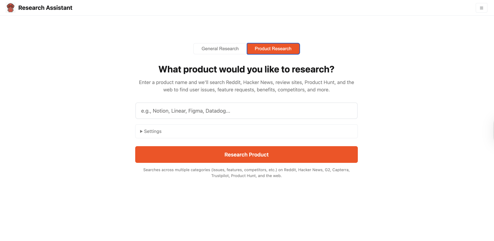
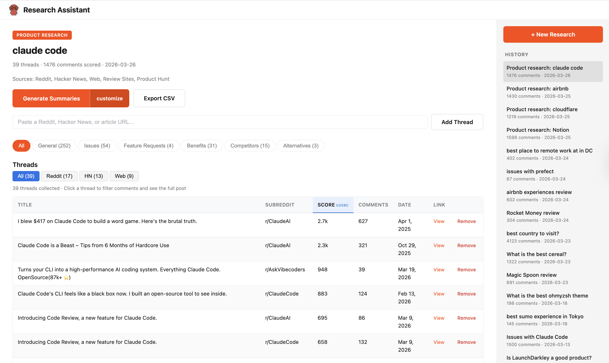

# Research Assistant

A web app that researches topics by collecting comments and articles from Reddit, Hacker News, Product Hunt and the web, scoring them for relevancy with AI, and generating cited summaries weighted by community sentiment.





## Two Research Modes

- **General Research** — Enter any question or topic. The app searches across sources, collects and scores comments, and generates a single cited summary.
- **Product Research** — Enter a product name. The app runs targeted searches across six categories (issues, feature requests, competitors, benefits, alternatives, general info) and generates a structured report with per-category summary cards.

## Setup

### 1. Install dependencies

```bash
pip3 install -r requirements.txt
```

### 2. Get API credentials

- **Reddit**: Create a "script" app at https://www.reddit.com/prefs/apps — note the client ID and secret
- **OpenAI**: Get an API key at https://platform.openai.com/api-keys
- **Product Hunt** (optional): Get a Developer Token at https://www.producthunt.com/v2/oauth/applications

### 3. Configure environment

```bash
cp .env.example .env
```

Edit `.env` with your credentials:

```
REDDIT_CLIENT_ID=your_client_id
REDDIT_CLIENT_SECRET=your_client_secret
OPENAI_API_KEY=sk-your-key-here
PRODUCT_HUNT_API_TOKEN=your_developer_token_here  # optional
```

### 4. Run

```bash
python3 app.py
```

Open http://localhost:5000.

## Usage

1. Choose **General Research** or **Product Research** on the homepage
2. Enter your question or product name, adjust settings (sources, max threads/comments, time range), and click Research
3. Watch the live activity feed as threads and comments are collected and scored
4. Browse the sortable Threads and Comments tables — click a thread to filter its comments and view the full post
5. Star interesting comments, set your own relevancy scores, and filter by source
6. Click **Summarize** (or **Generate Summaries** in product mode) for AI-generated summaries with numbered citations
7. Use **customize** to control comment count and provide focus instructions
8. In product mode, regenerate individual summary cards with per-card feedback
9. Click **Find More Comments & Articles** to expand your results, or **Export CSV** to download

## Configuration

| Variable | Default | Description |
|----------|---------|-------------|
| `REDDIT_CLIENT_ID` | (required) | Reddit app client ID |
| `REDDIT_CLIENT_SECRET` | (required) | Reddit app client secret |
| `REDDIT_USER_AGENT` | `ResearchAssistant/1.0` | User agent for Reddit API |
| `OPENAI_API_KEY` | (required) | OpenAI API key |
| `PRODUCT_HUNT_API_TOKEN` | (optional) | Product Hunt Developer Token |
| `LLM_MODEL` | `gpt-4o-mini` | OpenAI model to use |
| `PORT` | `5000` | Port to run the app on |

## Cost

Uses GPT-4o-mini for scoring and summarization. Typical cost: ~$0.02-0.05 per general research query, ~$0.10-0.15 per product research (more searches and 6 summary calls).

## Data

Research data is stored in `data/research.db` (SQLite). CSV exports are saved to `data/exports/`. The `data/` directory is created automatically and is git-ignored.
